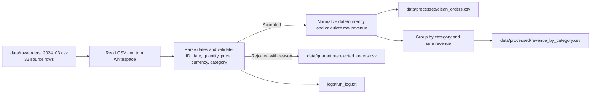

# Pipeline lineage

```mermaid
flowchart LR
    A["data/raw/orders_2024_03.csv<br/>32 source rows"] --> B["Read CSV and trim whitespace"]
    B --> C["Parse dates and validate ID, date, quantity, price, currency, category"]
    C -->|Accepted| D["Normalize date/currency and calculate row revenue"]
    C -->|Rejected with reason| E["data/quarantine/rejected_orders.csv"]
    D --> F["data/processed/clean_orders.csv"]
    D --> G["Group by category and sum revenue"]
    G --> H["data/processed/revenue_by_category.csv"]
    C --> I["logs/run_log.txt"]
```

The customer master file is retained as source context but not joined in this version.
